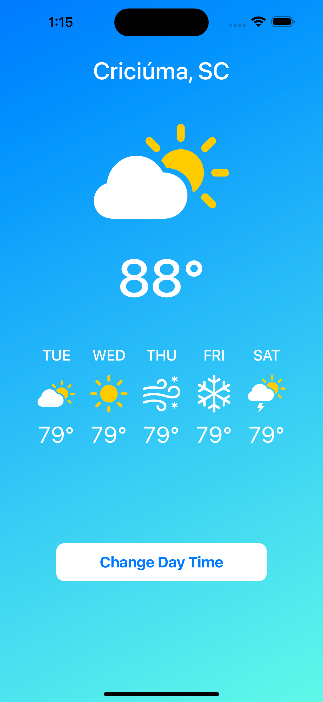
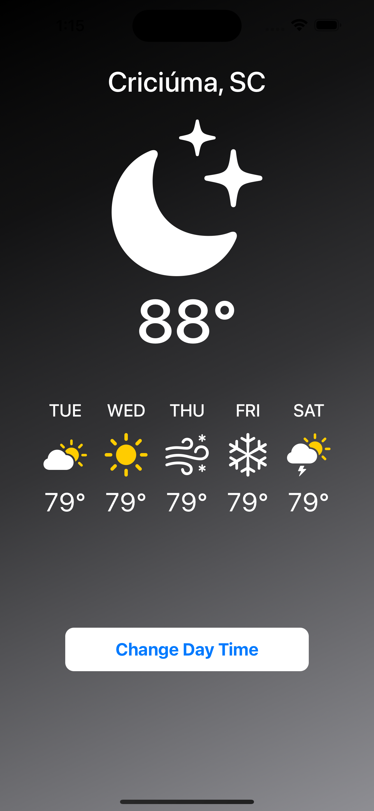

🇺🇸 This application was developed in Swift using SwiftUI, it is a basic application just to start practicing my skills in SwiftUI, it was developed following the step by step of Youtuber [Sean Allen](https://www.youtube.com/@seanallen/videos) in the video [SwiftUI Basics Tutorial](https://www.youtube.com/watch?v=HXoVSbwWUIk&t=17s)
<h3 align=center font="bold">Light mode ☀️ vs Dark mode 🌙 </h3>

      
    

